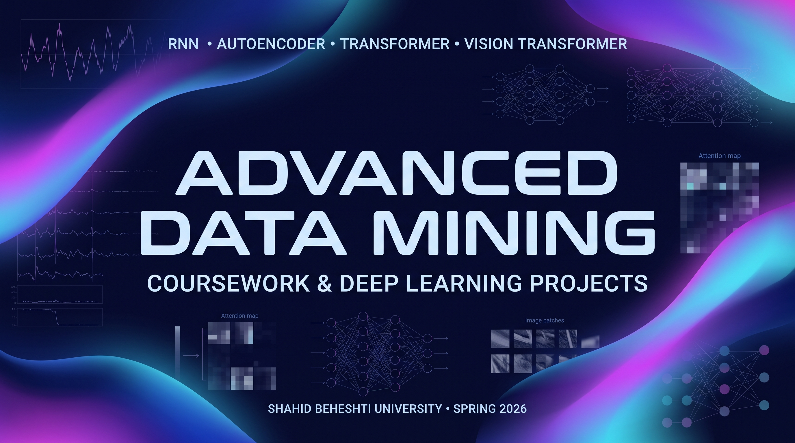

# Advanced Data Mining Coursework

Advanced Data Mining coursework featuring five assignments and a multi-part deep learning final project across RNNs, Autoencoders, Transformers, and Vision Transformers.

## Repository Structure

- `assignments/` — Five course assignments
- `final-project/` — Multi-part deep learning final project
  - RNN — Multivariate Weather Forecasting
  - Autoencoder — ECG Anomaly Detection
  - Transformer — AG News Text Classification
  - Vision Transformer — Plant Disease Classification

## Course Information

**Course:** Advanced Data Mining  
**University:** Shahid Beheshti University  
**Instructor:** Dr. Hadi Farahani  
**Term:** Spring 2026
